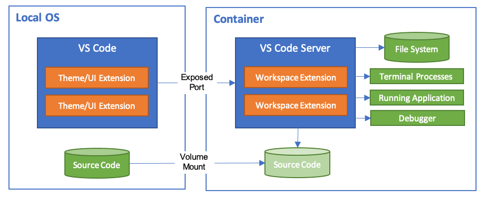
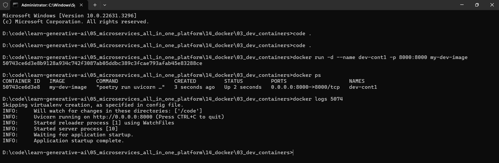
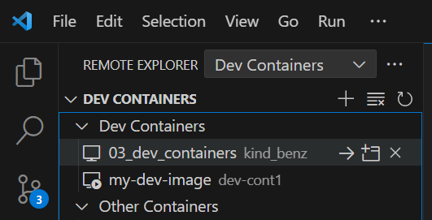

## Let's First Run the app without Docker to test if everything is working

We have updated our toml file using this as a base:

https://github.com/tiangolo/full-stack-fastapi-template/blob/master/backend/pyproject.toml

Note: Review each and every dependency in the toml file. So that you learn what are the different libraries used in development.

Install dependency:

    poetry install

Run project in Poetry Envirnoment, to see if it is running outside a container:

    poetry run uvicorn new_03_dev_container_1.main:app --host 127.0.0.1 --port 8000

Open in Browser:

    http://127.0.0.1:8000/

    http://127.0.0.1:8000/docs

    http://127.0.0.1:8000/openapi.json

# Developing inside a Container

We will edit the code we develop in the last step. 
This tutorial walks you through running Visual Studio Code in a Docker container using the [Dev Containers extension](https://marketplace.visualstudio.com/items?itemName=ms-vscode-remote.remote-containers).

https://code.visualstudio.com/docs/devcontainers/tutorial

</img>

The Dev Containers extension supports two primary operating models:

* You can attach to a running container to inspect it.
    
    https://code.visualstudio.com/docs/devcontainers/attach-container

* You can use a container as your full-time development environment
    
    https://code.visualstudio.com/docs/devcontainers/containers

## Attach to a Docker container

</img>

</img>

To attach to a Docker container, either select Dev Containers: Attach to Running Container... from the Command Palette (F1) or use the Remote Explorer in the Activity Bar and from the Containers view, select the Attach to Container inline action on the container you want to connect to.

## Developing inside a Container

System requirements

* You can use Docker with the Dev Containers extension in a few ways, including:

    * Docker installed locally.
    * Docker installed on a remote environment.
    * Other Docker compliant CLIs, installed locally or remotely.
        * While other CLIs may work, they are not officially supported.

## Video Tutorials

https://www.youtube.com/watch?v=h32qw986-tI

https://www.youtube.com/watch?v=7475K6UNLSA
